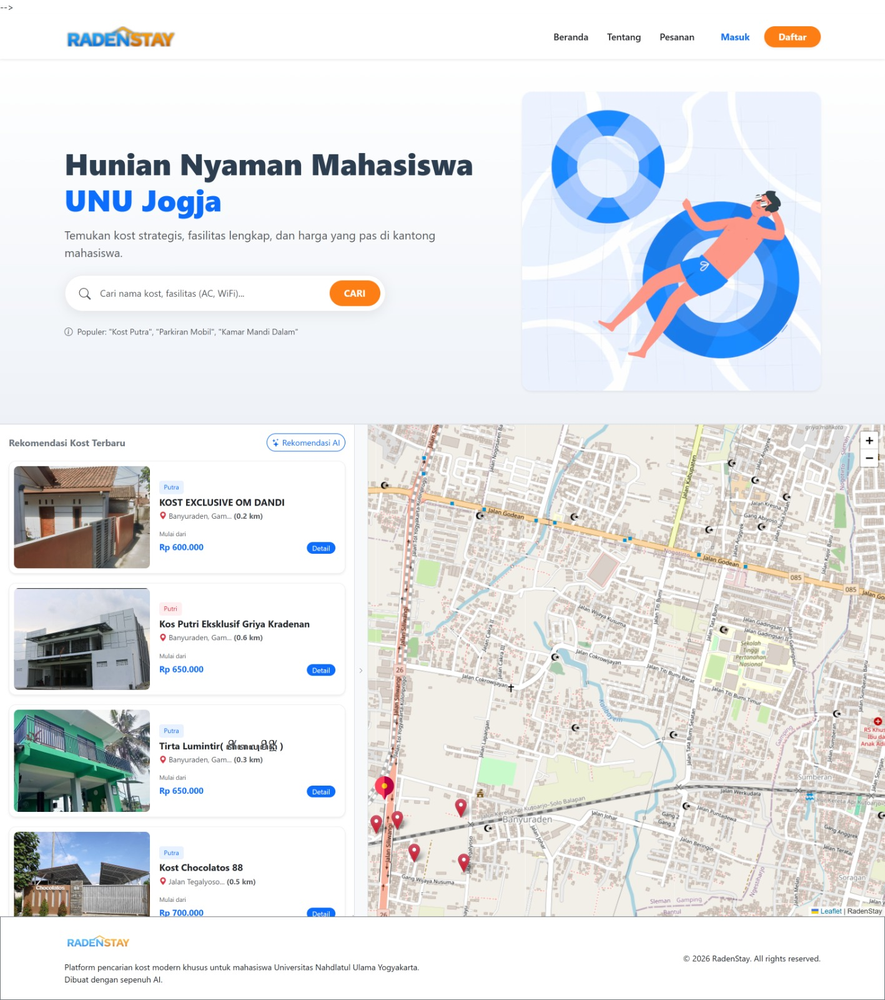

# 🏡 RadenStay - Sistem Rekomendasi Kost Cerdas Berbasis AI

RadenStay adalah platform informasi dan rekomendasi tempat kos yang dirancang khusus untuk mahasiswa Universitas Nahdlatul Ulama (UNU) Yogyakarta. Sistem ini tidak sekadar menampilkan daftar kos, tetapi menggunakan kecerdasan buatan (Machine Learning) dan Sistem Pendukung Keputusan (SPK) untuk memberikan rekomendasi yang paling akurat sesuai preferensi pengguna.

.png)
## ✨ Fitur Unggulan

RadenStay memadukan arsitektur *Microservice* (PHP & Python) untuk menghadirkan fitur-fitur canggih:

### 1. 🤖 Smart Recommendation System (AI - SAW)
Menggunakan algoritma **Simple Additive Weighting (SAW)** yang diproses melalui Python API untuk merangking kos terbaik berdasarkan 6 kriteria utama: Harga, Jarak ke Kampus, Fasilitas, Peraturan, Akurasi Info, dan Ulasan. 
* **Equalizer UI:** Pengguna dapat mengubah bobot prioritas kriteria secara dinamis (misal: lebih mengutamakan jarak daripada fasilitas).

### 2. 🗺️ Location Based Service (LBS) & Auto-Routing
Integrasi mendalam dengan **Leaflet.js** dan OpenStreetMap:
* Tampilan **Split View Map** yang interaktif (peta menyesuaikan ukuran layar dan posisi kartu kos).
* **Auto-Routing:** Menampilkan rute navigasi dan estimasi waktu tempuh dari Kampus UNU ke lokasi kos.

### 3. 🔍 Nearby Places Scanner (API Overpass)
Sistem secara otomatis memindai area sekitar kos dalam radius 1 KM untuk menemukan fasilitas umum terdekat seperti Rumah Sakit, Minimarket, ATM, dan Tempat Ibadah secara *real-time*.

### 4. 💰 Fair Price Checker (Machine Learning)
Fitur inovatif yang menggunakan model **Regresi Linear (Scikit-Learn)** untuk memprediksi harga wajar sebuah kos berdasarkan fasilitas dan jaraknya. Sistem akan otomatis melabeli kos sebagai "Murah Banget", "Wajar", atau "Kemahalan" dengan membandingkannya dengan data pasar.

### 5. 💬 Smart Review Summary (Sentiment Analysis)
Menganalisis puluhan teks ulasan menggunakan *Natural Language Processing* (NLP) sederhana di Python untuk memberikan ringkasan otomatis mengenai "Kelebihan" dan "Keluhan Utama" dari sebuah kos, menghemat waktu calon penyewa.

### 6. 🖼️ Virtual Tour 360°
Mendukung penayangan foto panorama 360 derajat (menggunakan Pannellum) agar calon penyewa dapat melihat kondisi kamar secara menyeluruh secara virtual.

---

## 🛠️ Teknologi yang Digunakan

Proyek ini dibangun menggunakan arsitektur hibrida untuk memisahkan beban antarmuka web dan beban komputasi AI.

**Frontend & Backend Web:**
* PHP 8.x (Native)
* HTML5, CSS3, JavaScript (Vanilla & AJAX)
* Bootstrap 5.3
* MariaDB (Database)

**AI & Decision Support Service:**
* Python 3.x
* Flask (REST API Framework)
* Pandas & NumPy (Matriks & Komputasi SAW)
* Scikit-Learn (Regresi Linear untuk Prediksi Harga)

**Peta & Geospasial:**
* Leaflet.js
* Leaflet Routing Machine
* Overpass API (OpenStreetMap)

---

## 🚀 Panduan Instalasi (Deployment)

Karena menggunakan arsitektur hibrida, Anda perlu menjalankan Web Server (PHP) dan API Service (Python) secara bersamaan.

### Prasyarat
* Web Server terinstal (Apache/Nginx) dengan PHP 8.x dan MariaDB.
* Python 3.10 terinstal.

### Langkah 1: Setup Web Server (PHP)
1.  *Clone* repositori ini ke direktori *web root* Anda (misal: `htdocs` atau `www/html`).
    ```bash
    git clone [https://github.com/Muhsin-IT/sistem-rekomendasi-kost.git](https://github.com/Muhsin-IT/sistem-rekomendasi-kost.git)
    ```
2.  Buat database baru di MariaDB (misal: `db_kost`).
3.  Impor file `db_kost.sql` ke dalam database yang baru dibuat.
4.  Edit konfigurasi koneksi pada file `koneksi.php` sesuai dengan kredensial database Anda.

### Langkah 2: Setup AI Service (Python)
1. Buka terminal dan arahkan ke direktori proyek.
2. (Opsional namun disarankan) Buat dan aktifkan *Virtual Environment*.
   ```bash
   python -m venv venv
   source venv/bin/activate  # Untuk Linux/Mac
   venv\Scripts\activate     # Untuk Windows
3. Instal dependensi Python yang dibutuhkan:
   ```bash
   pip install Flask pandas numpy scikit-learn
4. Jalankan server Flask:
    ```bash
    python app.py
- API akan berjalan secara default di http://127.0.0.1:5001.

### Langkah 3: Konfigurasi Endpoint API
Pastikan URL API di dalam file PHP Anda sudah mengarah ke alamat layanan Python yang benar. Periksa variabel $api_url pada file berikut:
- search.php
- ajax_get_kost.php
- detail_kost.php

---

### 👨‍💻 Kontributor
* Dikembangkan oleh Tim 3  **Pemrogaman Python | Manajemen Proyek | Rekayasa Perangkat Lunak**

    * **Muhammad Muhsin** - *Full Stack Developer | System Analyst | Software Tester*
    * **Nailul Ashfya** – *UI/UX Designer | Documentation*
    * **Qolbin Salim** – *Project Manager | Documentation*
    * **Malihatus Saniyah** – *Technical Writer | Documentation*
    * **M Raffi Fadhila** – *System Analyst | Data Researcher*
    * **M Kholid Ramadhan** – *Quality Assurance (QA) | Documentation* 

* Proyek ini dibangun sebagai bagian dari penyelesaian Tugas Akhir di Universitas Nahdlatul Ulama (UNU) Yogyakarta.

---

### 📚 Tampilan Website


---
### 📄 Lisensi & Hak Cipta
*© 2025 [Muhsin-It](https://github.com/Muhsin-IT). All Rights Reserved.*
*Source code ini dapat dipelajari dan dikembangkan lebih lanjut. [Kunjungi profil GitHub saya](https://github.com/Muhsin-IT) untuk pembaruan atau proyek lainnya*
